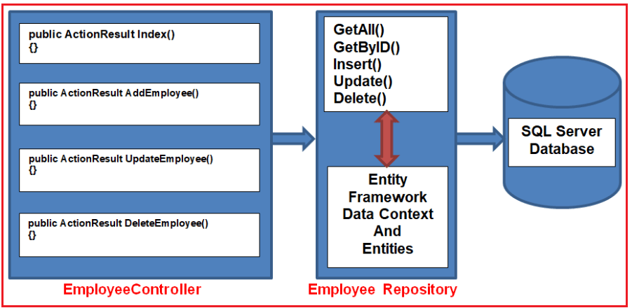

# [Repository Design Pattern in C#](https://dotnettutorials.net/lesson/repository-design-pattern-csharp/)

## What is the Repository Design Pattern in C#?

- The Repository Design Pattern in C# Mediates between the domain and the data mapping layers using a collection-like interface for accessing the domain objects.

- In other words, we can say that a Repository Design Pattern acts as a middleman or middle layer between the rest of the application and the data access logic. That means a repository pattern isolates all the data access code from the rest of the application. 

- The advantage of doing so is that, if you need to do any changes then you need to do it in one place. 
  
- Another benefit is that testing your controllers becomes easy because the testing framework need not run against the actual database access code. With repository design pattern, the previous diagram will change to the following diagram:
  
  
 
-  All these operations (i.e. CRUD operations) are wrapped by the Employee Repository. The Employee Repository uses the Entity Framework data context class to perform the CRUD operations. 
  
-  As you can see from the above diagram, now the Employee repository has methods such as GetAll(), GetByID(), Insert(), Update() and Delete(). 
  
- These methods are going to perform the Typical CRUD operations against the underlying database.
  
-  The Employee controller uses those methods to perform the required database operations.
  
---

## Understanding the Responsibility of each method:

GetAll(): This method is used to return all the Employee entities as an enumerable collection (such as a generic List).

GetById(): This method accepts an integer parameter representing an Employee ID (EmployeeID is an integer column in the Employee table in the database) and returns a single Employee entity matching that Employee ID.

Insert(): This method accepts an Employee object as the parameter and adds that Employee object to the Employees DbSet.

Update(): This method accepts an Employee object as a parameter and marks that Employee object as a modified Employee in the DbSet.

Delete(): This method accepts an EmployeeID as a parameter and removes that Employee entity from the Employees DbSet.

Save(): This method saves changes to the EmployeeDB database.